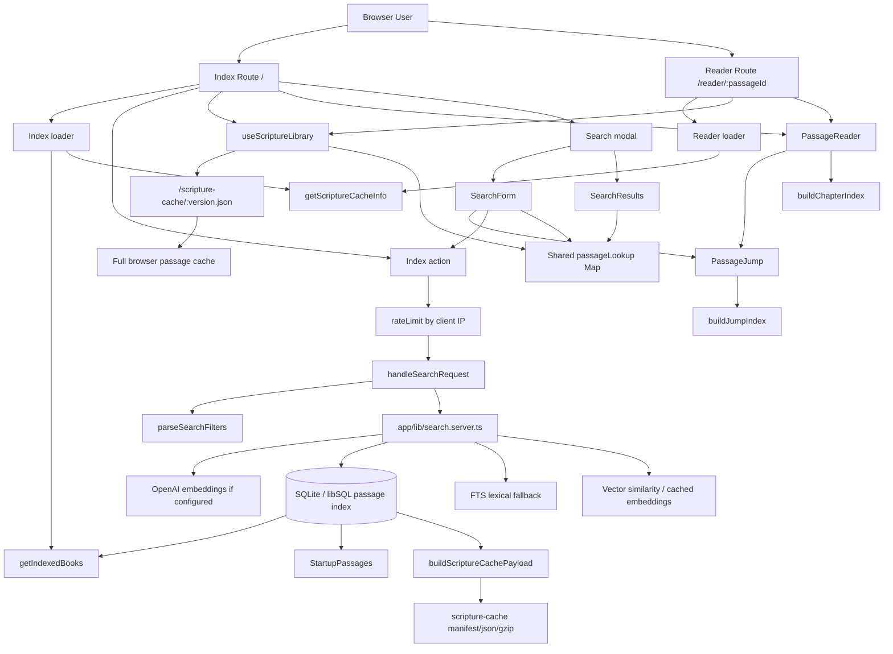
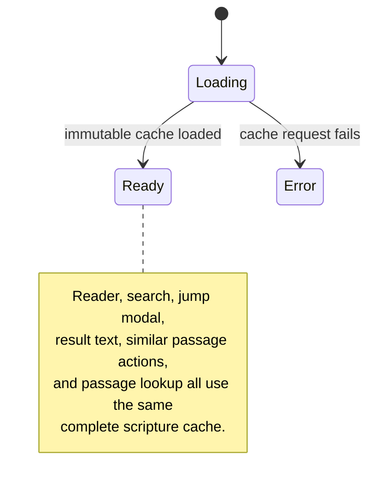
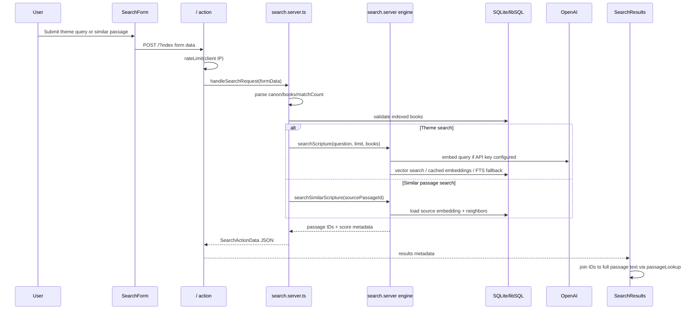
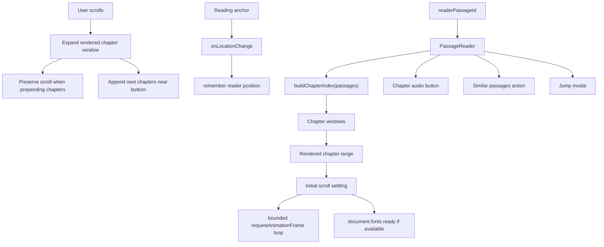
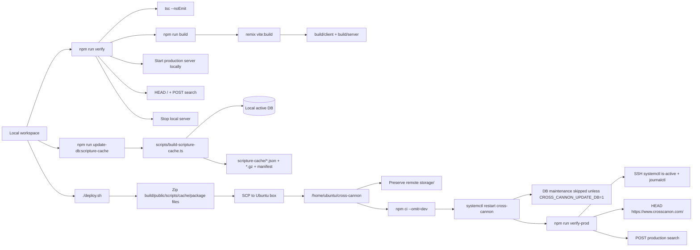

# Cross Cannon Architecture

This document maps the key runtime, search, reader, build, deploy, and
verification flows in Cross Cannon.

## Rendering

GitHub renders these Mermaid diagrams directly in the file preview.

Local options:

```bash
# Open the HTML renderer in a browser.
open docs/architecture.html

# Or render a single Mermaid file to SVG/PNG with Mermaid CLI.
npx -y @mermaid-js/mermaid-cli -i docs/runtime-architecture.mmd -o docs/runtime-architecture.svg
npx -y @mermaid-js/mermaid-cli -i docs/runtime-architecture.mmd -o docs/runtime-architecture.png

# Render every diagram and create docs/cross-cannon-architecture.png.
npm run render:architecture
```

VS Code also renders this file with an extension such as
`Markdown Preview Mermaid Support`.

## Runtime Architecture



## Scripture Readiness



## Search Flow



## Reader Flow



## Build, Deploy, And Verification



## Ownership Boundaries

```text
app/routes/
  Thin Remix route wiring: loaders, actions, page composition.

app/features/scripture/
  Browser scripture cache loading, shared readiness state, passageLookup.

app/features/search/
  Search UI, filters, result rendering, server-side form/search handling.

app/features/passage-reader/
  Reader layout, chapter windows, scroll preservation, passage actions.

app/features/passage-jump/
  Book/chapter/verse navigation modal.

app/lib/
  Database setup, scripture cache server metadata, embeddings, search engine,
  rate limiting, audio chapter helpers.

scripts/
  Index/build/download/deploy-adjacent operational scripts plus verification.
```
